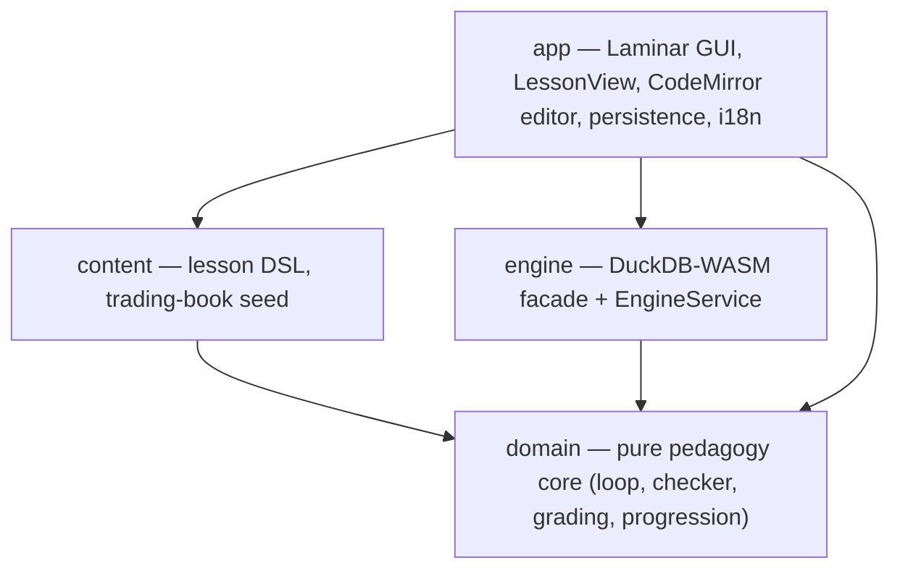
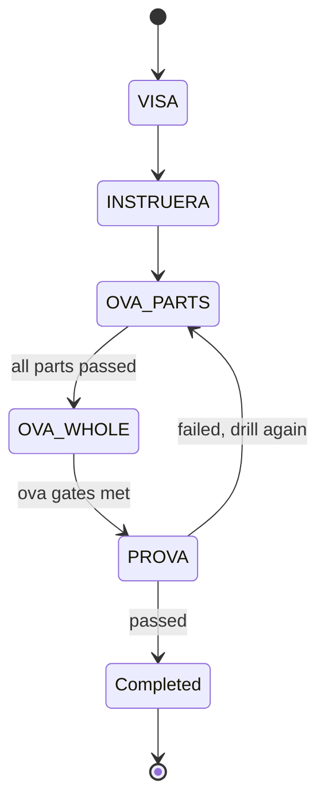

# Architecture

Drillbänken is a static, client-side Scala.js application. SQL runs in the browser via
DuckDB-WASM; the UI is a guided web interface (CodeMirror SQL editor) rendered by
Laminar. There is no backend. (Pre-v2.0.0 the UI was an xterm.js console.)

## Modules

A single sbt build with Scala.js subprojects. The `domain` core is pure (no Laminar, no
DOM, no interop) so the pedagogy invariants are property-tested in isolation.

## The instruction loop (typed state machine)

Every lesson advances through the Försvarsmakten loop. The PRÖVA gate cannot be entered
until the ÖVA gates are met; a failed PRÖVA routes back to the specific drills.

## Interop boundary

JS interop is confined behind narrow boundaries: `engine` wraps DuckDB-WASM
(`EngineService`), and `app` wraps the CodeMirror SQL editor (`SqlEditor`). Facades are
hand-written `js.native` (minimal surface) — ScalablyTyped was evaluated but OOM'd the
compiler on the DuckDB-WASM + Apache Arrow facade tree (see
`specs/002-console-sql-tutor/research.md` D2). DuckDB `.wasm` and worker assets are
bundled by Vite via `?url` imports — no runtime CDN.

## Persistence

Progress (unlocks, grades, streak, per-lesson resume snapshot, language) is stored in
`localStorage` as JSON via a pure uPickle codec, and is exportable/importable. No accounts,
no server, no cookies.
